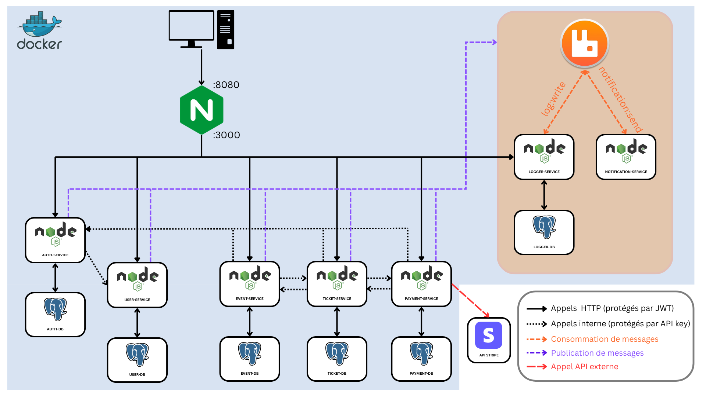

# 4WEBD Booking



A microservices-based ticketing system for concerts and events.
This project is a backend-only API and does not include any frontend application. All interactions are performed through HTTP endpoints.

## Stack

- **Runtime**: Node.js / TypeScript
- **Framework**: Express
- **Database**: PostgreSQL (one per service)
- **ORM**: Prisma
- **Message Broker**: RabbitMQ
- **Payment**: Stripe
- **Reverse Proxy**: Nginx
- **Containerization**: Docker / Docker Compose

## Architecture

The system is composed of the following services:

| Service              | Description                        |
| -------------------- | ---------------------------------- |
| auth-service         | Authentication and user management |
| user-service         | User profile management            |
| event-service        | Event management                   |
| ticket-service       | Ticket purchasing and validation   |
| payment-service      | Payment processing via Stripe      |
| notification-service | Email notifications                |
| logger-service       | Logging                            |

## Prerequisites

- Docker
- Docker Compose
- Node.js

### Email Configuration (Mailtrap)

To receive emails sent by the `notification-service`, a Mailtrap account must be configured.

A detailed setup guide is available here:

- [Mailtrap setup guide](./mailtrap-tuto.pdf)

All emails sent by the application will then be available in your Mailtrap inbox.

## Getting Started

### 1. Clone the repository

```bash
git clone https://github.com/Skyzzee/4WEBD-BOOKING.git
cd 4WEBD-BOOKING
```

### 2. Start the infrastructure

```bash
npm run start
```

Wait until all services are fully started.

### 3. Initialize databases and seed data

Open a new terminal and run:

```bash
npm run setup:data
```

This command will:

- initialize all Prisma schemas
- populate the databases with initial data

### 4. Access the application

The API is available at:

```
http://localhost:8080
```

## Default Users

The following users are available after seeding:

| Role          | Email               | Password    |
| ------------- | ------------------- | ----------- |
| ADMIN         | admin@booking.com   | Admin1234   |
| EVENT_CREATOR | creator@booking.com | Creator1234 |
| USER          | user@booking.com    | User1234    |

## Running Tests

From the root of the project:

```bash
npm test
```

## API Documentation

Each service exposes its own Swagger UI documentation:

| Service  | URL                                                                                |
| -------- | ---------------------------------------------------------------------------------- |
| Auth     | [http://localhost:8080/api/auth/docs](http://localhost:8080/api/auth/docs)         |
| Events   | [http://localhost:8080/api/events/docs](http://localhost:8080/api/events/docs)     |
| Payments | [http://localhost:8080/api/payments/docs](http://localhost:8080/api/payments/docs) |
| Tickets  | [http://localhost:8080/api/tickets/docs](http://localhost:8080/api/tickets/docs)   |
| Users    | [http://localhost:8080/api/users/docs](http://localhost:8080/api/users/docs)       |
